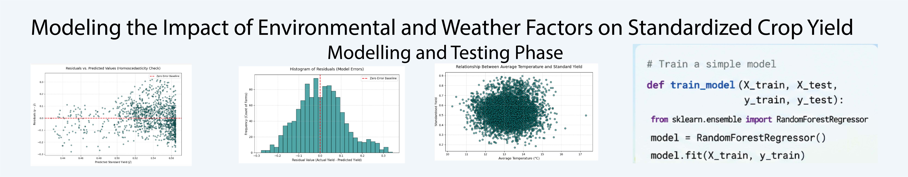

# Modeling-the-Impact-of-Environmental-and-Weather-Factors-on-Standardized-Crop-Yield
In this project, I build and evaluated a Multiple Linear Regression model that accurately predicts the standardized crop yield (Standard_yield) based on environmental, geographic, and weather-driven features.

# Primary Objective
- To build and evaluate a Multiple Linear Regression model that accurately predicts the standardized crop yield (Standard_yield) based on environmental, geographic, and weather-driven features.

# Project Objectives

## 1. Specific Objectives
- Quantify Weather Impacts: Determine the specific extent to which variation in weather elements (such as average temperature and rainfall) influences overall field productivity.

- Assess Geographic and Soil Features: Analyze the relationship between a field's physical baseline characteristics (elevation, slope, and soil fertility) and its standardized yield.

- Evaluate Environmental Stressors: Isolate and measure the negative impact of external environmental constraints (such as local Pollution_level) on crop output.

- Feature Selection & Optimization: Identify which subset of environmental factors holds the highest predictive power, allowing for a more streamlined, optimized model.

## 2. Statistical & Diagnostic Objectives

- Validate Classical Linear Regression Assumptions:

Ensure model reliability by testing for linearity, homoscedasticity, normality of residuals, and identifying/mitigating multicollinearity (especially among temperature variables like Ave_temps, Min_temperature_C, and Max_temperature_C).

- Interpret Coefficients for Actionable Insights:

Utilize the model's coefficients to provide data-driven recommendations on which natural factors are the strongest catalysts or detractors for farm performance across the region.

# 3. Technologies & Tools Used
### 1. **Core Environment & Language**
- Python:

The primary programming language used for data engineering, statistical computation, and predictive modeling.
  
- Jupyter Notebooks:

The interactive development environment (IDE) utilized for step-by-step data exploration, visualization rendering, and documenting the model lifecycle.
  
### 2. **Data Manipulation & Preprocessing**

- Pandas:
  
Used for structured data manipulation, handling missing values, filtering features based on the data dictionary, and performing one-hot encoding on categorical variables.
  
- NumPy:

Employed for high-performance vectorized numerical operations and mathematical transformations.

### 3. **Statistical Modeling & Machine Learning**
   
- Statsmodels:

Utilized to build the Ordinary Least Squares (OLS) regression model, check detailed regression diagnostics, evaluate $p$-values, and test for statistical assumptions (like homoscedasticity and normality of residuals).

- Scikit-Learn (sklearn):

Used for splitting the dataset into training and testing sets (train_test_split) and evaluating predictive performance metrics like Root Mean Squared Error (RMSE) and $R^2$.

### 4. **Data Visualization**
   
- Matplotlib:

The foundational library used to customize and render baseline plots, distributions, and individual regression lines.

- Seaborn:

Built on top of Matplotlib, used to generate high-level statistical graphics such as the multicollinearity correlation heatmap and residual diagnostic plots.

# Initial data exploration
- Simple linear regression is a fundamental statistical method used to quantify the relationship between two variables. It allows the predict an outcome (dependent variable) based on the value of one predictor (independent variable).
- I will apply simple linear regression to understand how different environmental factors affect the standardised yield of crops.
- The insights will not only help local farmers maximise their harvests but also contribute to the sustainable agriculture practices
  
## Data exploration
- Before we sow the seeds of the regression model, we need to get to know our soil – the dataset. This dataset was developed through extensive agricultural surveys conducted at farms. It contains various factors that might influence a farm's crop yield, from the elevation of the fields to the average temperature they bask in.

## Conclusion

Linear regression, for all its strengths, assumes a straightforward relationship between the predictor and the outcome. Yet, the natural world seldom adheres to such simplicity. Factors influencing crop yields be it temperature, rainfall, or pollution – interact in complex, often nonlinear ways. Our initial model with `Ave_temps` hinted at this complexity, suggesting that the effect of the average temperature on yields might follow a more intricate pattern than a straight line can depict (or no pattern at all).

Our yield also depends on more than just the pollution or the temperature; it depends on many of the factors – we could see that from our EDA. We also saw that not all crops are affected equally by pollution or temperature, so we could simplify our model if we remove the influence of the different crops.

As we dive deeper into regression, it's crucial to remember that with each model comes a new perspective. Just as a farmer selects the tool that best suits the task at hand, so we must choose our models with intention and insight. Exploring beyond linear regression opens up new vistas of understanding, allowing us to capture the richness of relationships within our data.

#  

